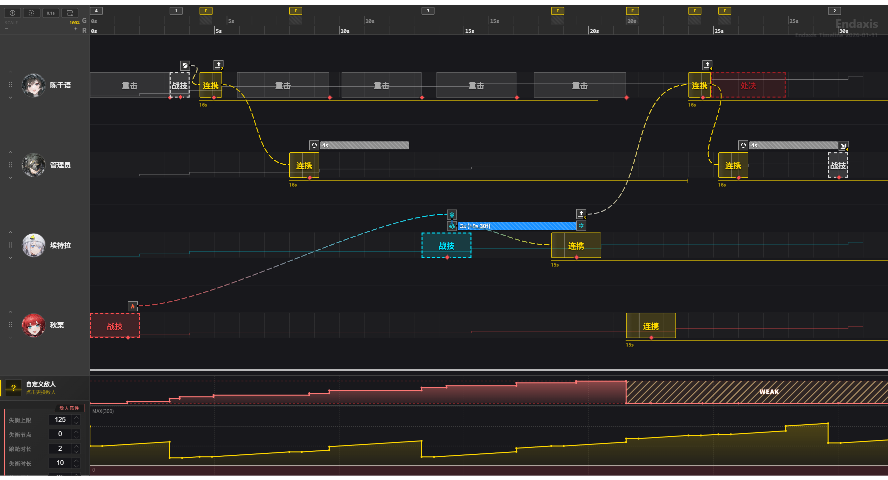

# Endfield Timeline Editor - 《明日方舟：终末地》排轴工具

**Endaxis** 是一个基于 Web 专为《明日方舟：终末地》设计的可视化时间轴编辑工具。

> ⚠️ **注意**：本项目是一个粉丝自制工具，目前处于开发阶段。

## 在线体验

**项目已部署，点击下方链接即可直接使用：**

**<https://www.end-axis.com/>**

## 目前所能实现的效果



## 核心功能

- **高精度排轴**：基于 CSS Grid 的时间网格，支持精确到 `1帧` 的动作块拖拽与对齐。
- **拖放交互**：使用 `Vue.Draggable` 实现流畅的技能拖放体验，支持从技能库拖入轨道及轨道内调整。
- **连携可视化**：通过 SVG 动态绘制贝塞尔曲线，实时显示技能之间的连携与依赖关系。
- **多角色管理**：支持动态切换轨道干员，严格的放置判定逻辑确保操作准确性。

## 🛠️ 技术栈

本项目使用现代前端技术栈构建：

- **框架**: [Vue 3](https://vuejs.org/) (Composition API)
- **构建工具**: [Vite](https://vitejs.dev/)
- **状态管理**: [Pinia](https://pinia.vuejs.org/)
- **UI 组件库**: [Element Plus](https://element-plus.org/)
- **国际化**: [vue-i18n](https://vue-i18n.intlify.dev/)
- **拖拽库**: [Vue.Draggable](https://github.com/SortableJS/vue.draggable.next)
- **样式**: CSS Grid + CSS Variables

## i18n（基础配置）

目前项目已完成 vue-i18n + Element Plus 语言包的基础接入（见 `src/i18n/index.js`）。

- 默认语言：`zh-CN`
- 语言持久化：`localStorage` key 为 `endaxis_locale`
- 翻译文件：`src/i18n/locales/zh-CN.json`

## 本地开发

如果你想在本地运行或参与开发：

### 环境要求

- Node.js (`^20.19.0 || >=22.12.0`)
- npm 或 yarn

### 安装依赖

```bash
npm install
```

### 启动开发服务器

```bash
npm run dev
```

启动后访问 `http://localhost:5173` 即可看到排轴器界面。
